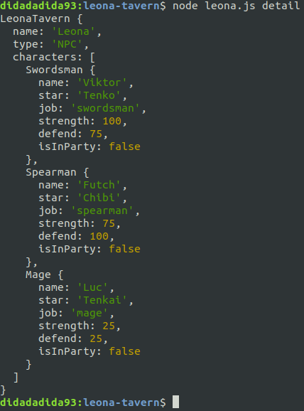
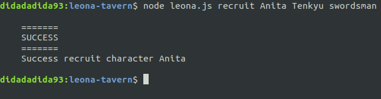
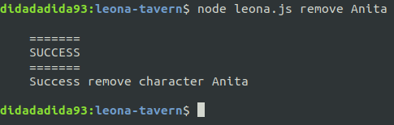
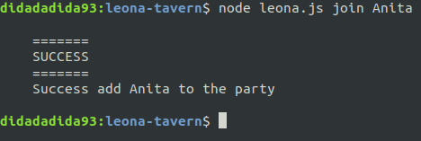
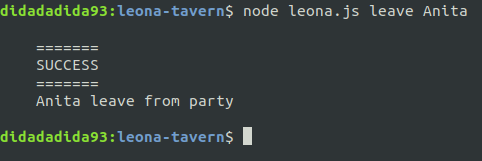
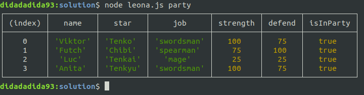
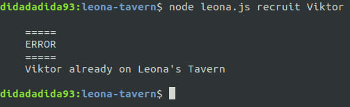
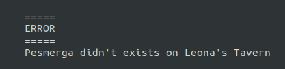

# Leona's Tavern

⏰ Time Estimation 100 minutes.
> Kalian di harapkan dapat menyelesaikan challenge ini dalam waktu 100 minutes, jika pertama percobaan masih diatas waktu yang di tentukan, wajib kalian coba lagi hingga pengerjaan kalian mampu di bawah waktu yang dit tentukan. INGAT !!! **WAJIB DI COBA KEMBALI**

## Summary

Untuk kalian yang pernah bermain game _Suikoden II_ pasti sudah tidak asing lagi dengan _NPC Leona_. Buat kalian yang tidak tahu, _Leona_ adalah _NPC_ tempat kita merekrut karakter untuk berpetulang bersama dengan _Main Character_. Pada livecode kali ini, kalian diminta untuk membuat aplikasi sederhana yang menyerupai dengan tugas dan fungsi dari _NPC Leona_.

## Release 0

Buatlah sebuah class `LeonaTavern` yang meiliki property sebagai berikut:

- `name` : default value `Leona`
- `type` : default value `NPC`
- `characters` : kumpulan instance dari class `Character`

Kemudian buatlah class `Character` yang memiliki property sebagai berikut:

- `name` : nama dari `Character`
- `star` : zodiac dari `Character`
- `job` : job dari `Character`
- `strength` : strength dari `Character`
- `defend` : defend dari `Character`
- `isInParty` : status dari `Character` apakah sedang didalam party atau tidak

Berdasarkan `job` nya, class `Character` terbagi menjadi 3 jenis yaitu:

- `Swordsman` yang memiliki `strength` **100** dan `defend` **75**
- `Spearman` yang miliki `strength` **75** dan `defend` **100**
- `Mage` yang miliki `strength` **25** dan `defend` **25**

## Release 1

> Format data pada `characters.json` **tidak boleh dirubah**.

Buatlah sebuah fitur untuk menampilkan semua character berdasarkan data dari `characters.json`.
Commandnya adalah:

```bash
$ node leona.js detail
```

Output yang diharapkan:



## Release 2

Buatlah sebuah fitur untuk merekrut character baru.
Format command nya adalah:

```bash
$ node leona.js recruit <character's name> <character's star> <character's job>
```

Contoh commandnya adalah sebagai berikut:

```bash
$ node leona.js recruit Anita Tenkyu swordsman
```

Output yang diharapkan:



> ketika merekrut character baru, secara default status `isInParty` nya `false`.

## Release 3

Buatlah fitur untuk mengeluarkan character dari _Leona's Tavern_.
Format commandnya adalah:

```bash
$ node leona.js remove <character's name>
```

Contoh commandnya adalah sebagai berikut:

```bash
$ node leona.js remove Viktor
```

Output yang diharapkan:



## Release 4

Buatlah sebuah fitur untuk memasukan character kedalam party, dimana fitur ini akan mengupdate property `isInParty` menjadi `true`.
Format commandnya adalah:

```bash
$ node leona.js join <character's name>
```

Contoh commandnya adalah sebagai berikut:

```bash
$ node leona.js join Anita
```

Output yang diharapkan:



## Release 5

Buatlah sebuah fitur untuk mengeluarkan character dari party, dimana fitur ini akan mengupdate property `isInParty` menjadi `false`.
Format commandnya adalah:

```bash
$ node leona.js leave <character's name>
```

Contoh commandnya adalah sebagai berikut:

```bash
$ node leona.js leave Anita
```

Output yang diharapkan:



## Release 6

Buatlah fitur untuk menampilkan character yang sedang ada didalam party.
Pada fitur ini, kalian boleh menggunakan `console.table` untuk menampilkan hasilnya dalam bentuk table.
Commandnya adalah:

```bash
$ node leona.js party
```

Output yang diharapkan:



## Release 7

Buatlah validasi terhadap beberapa fitur, seperti

1. Ketika merekrut character baru, pastikan character tersebut belum ada didalam _Leona's Tavern_.
2. Ketika mengeluarkan character, pastikan character tersebut ada didalam _Leona's Tavern_.
3. Ketika memasukan character kedalam party, pastikan character tersebut ada didalam _Leona's Tavern_.
4. Ketika mengeluarkan character dari party, pastikan character tersebut ada didalam _Leona's Tavern_.

Output yang diharpakan:



